# Project1
Group work for Computer Systems Security, project 1.

---

## Introduction

Trevor Chaney: Assisted in data collection for all tasks and wrote the closing section for section V. The group had three weekly meetings to work on tasks for ~2 hours on Mondays, Wednesdays, and Fridays.

---

## Network Diagnosis, Task II

---

### A) NMap commands to scan the computers and the service ports
The following are the commands that were used in the collection of data on open ports and services on the networks.

Network A:
```bash
$ nmap 172.16.0.0/24
```

Network B:
```bash
$ nmap 10.0.0.0/24
```

---

### B) Discovered IP's and services in Network A and B

---

#### 1) Run NMap in A.2 on Network A

`nmap 172.16.0.0/24`

The following are the discovered IP's and services on Network A:

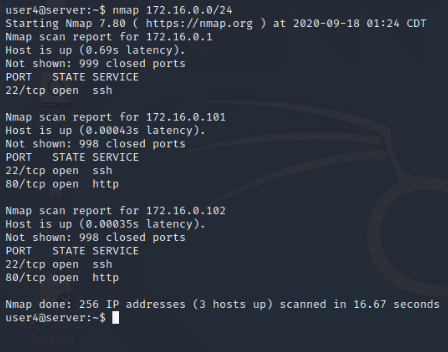

#### 2) Run NMap in A.2 on Network B

`nmap 10.0.0.0/24`

The following are the discovered IP's and services on Network B:

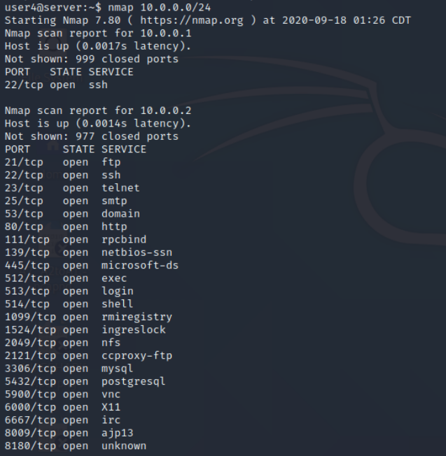

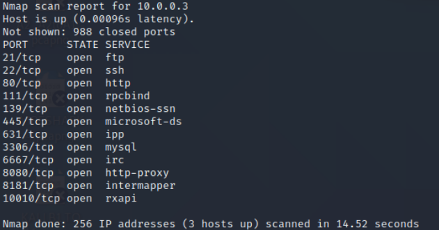

---

### C) Wireshark results of checking the web service between B.1 and A.1, and, A.2 and A.1

---

The following are screenshot of the web service data collection in wireshark from 'A.1', 'A.2', and 'R'.

#### B.1 and A.1
This section shows the data collected that was passed between B.1 and A.1 and by which observer.

A.1 observed the following:

**HTTP**

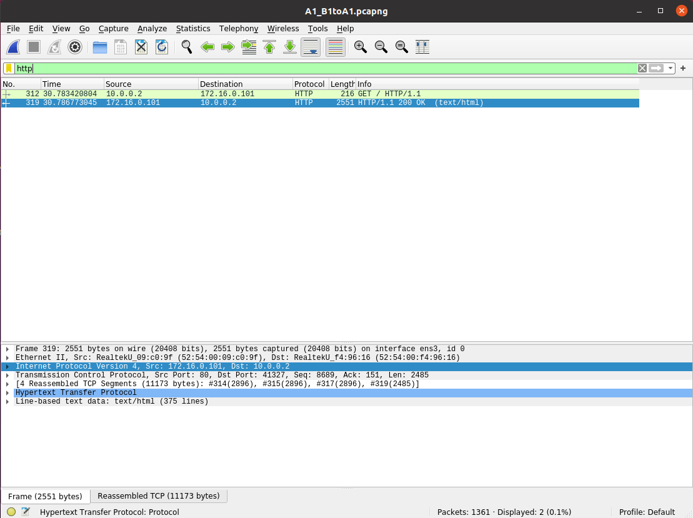

**SSH**

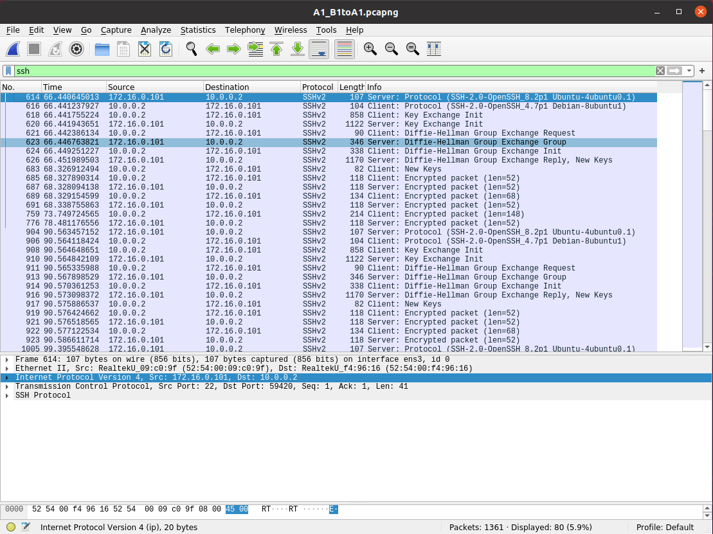

A.2 observed the following:

**WARNING**
A.2 did not show any network traffic for Ping, Curl, or SSH traffic.

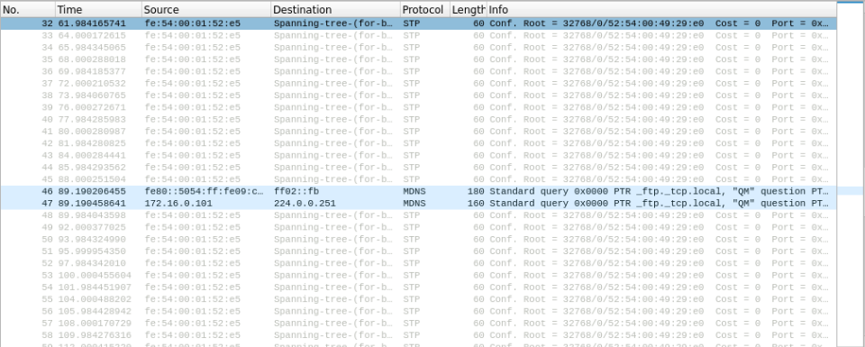

R observed the following:

**HTTP**

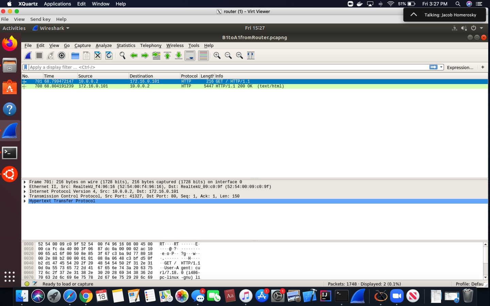

#### A.2 and A.1
This section shows the data collected that was passed between A.2 and A.1 and by which observer.

A.1 observed the following:

**HTTP**

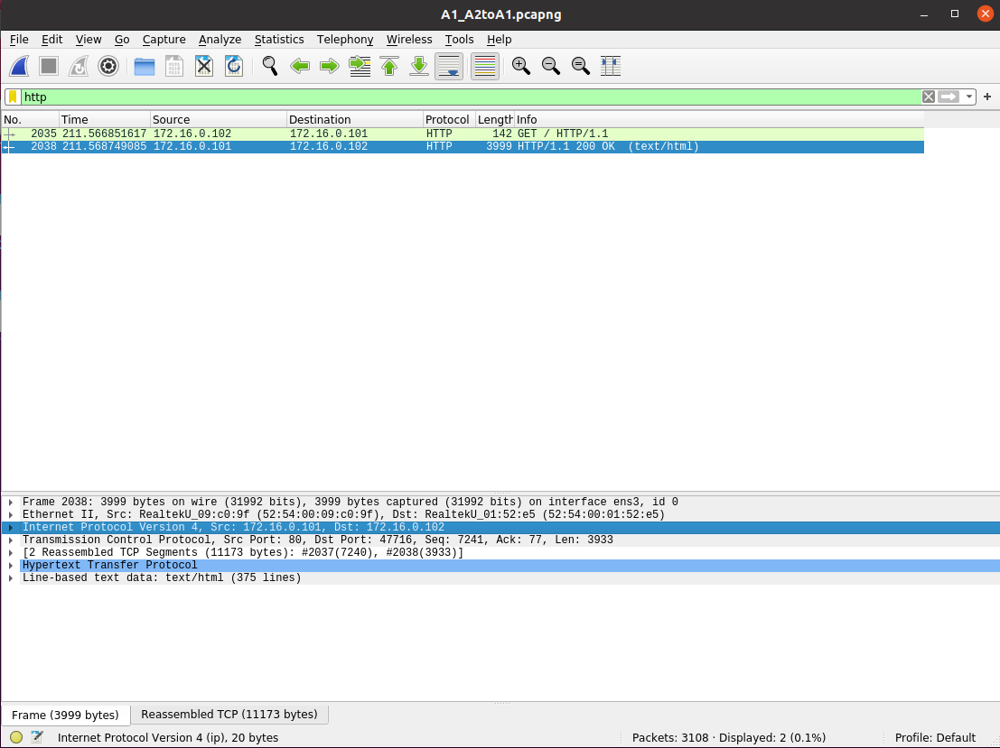

**SSH**

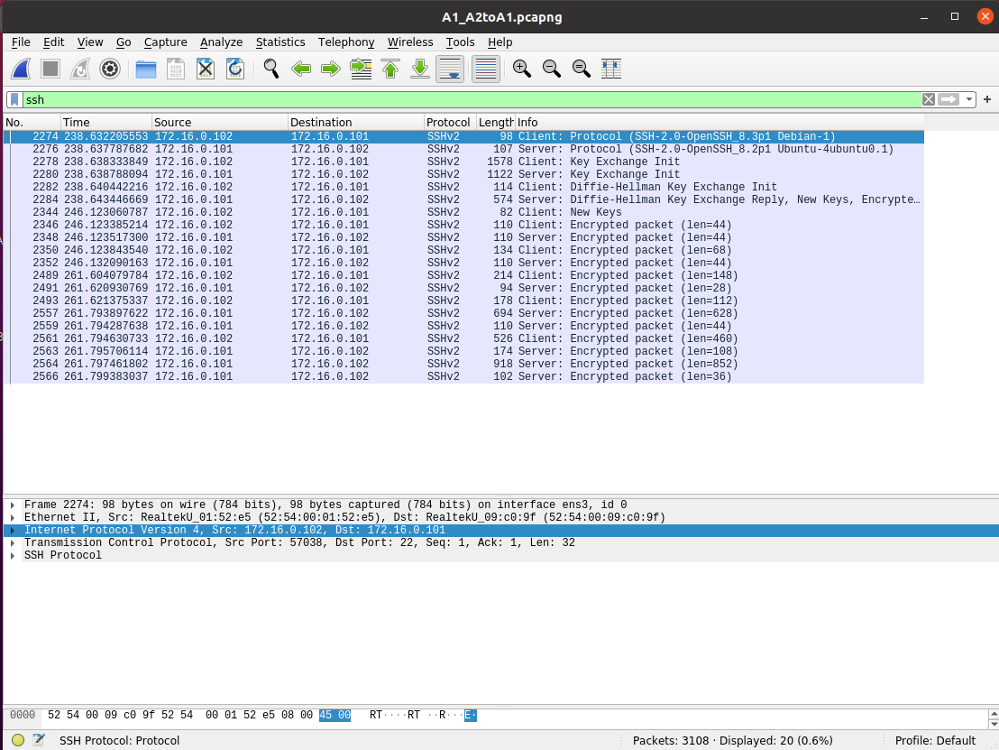

A.2 observed the following:

**HTTP**

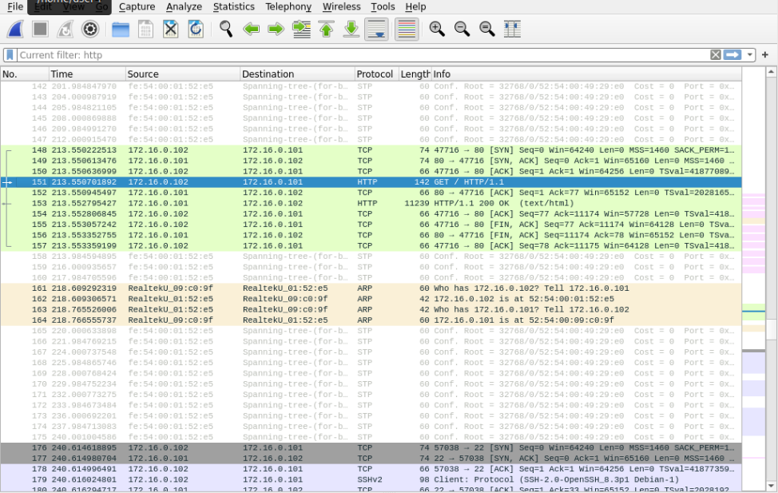

**SSH**


R observed the following:

**WARNING**
The router did not observe any web service traffic between A.2 and A.1.

---

### D) Wireshark results of checking the ping between B.1 and A.1, and, A.2 and A.1

---

The following are screenshot of the web service data collection in wireshark from 'A.1', 'A.2', and 'R'.

#### B.1 and A.1
This section shows the data collected that was passed between B.1 and A.1 and by which observer.

A.1 observed the following:

**ICMP**

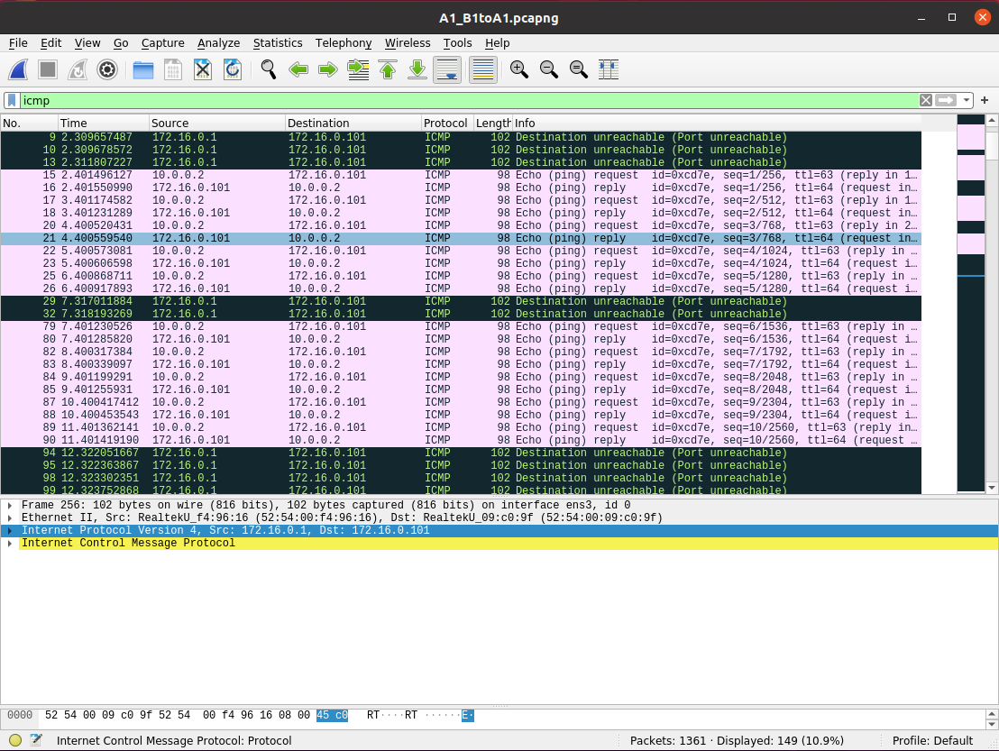

A.2 observed the following:

**WARNING**
A.2 did not show any network traffic for Ping, Curl, or SSH traffic.


R observed the following:


#### A.2 and A.1
This section shows the data collected that was passed between A.2 and A.1 and by which observer.

A.1 observed the following:

**ICMP**

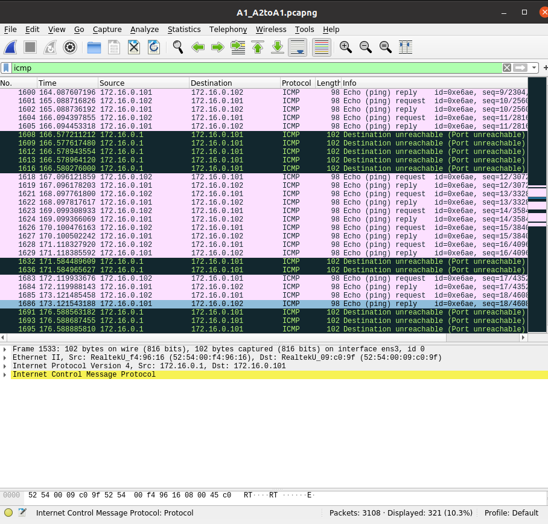

A.2 observed the following:

**ICMP**

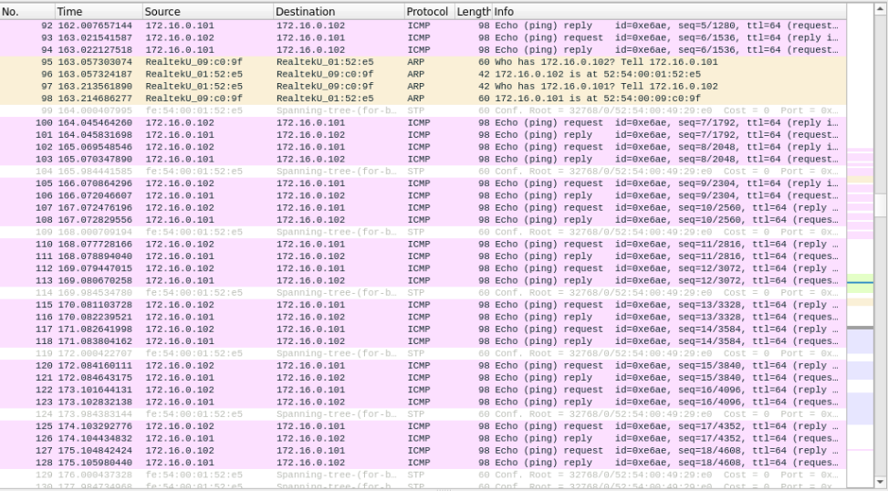

R observed the following:

**WARNING**
The router did not observe any ping traffic between A.2 and A.1.

---

## Impliment Security Policy, Task III

---

### A) Access Control Matrix

| Name:             | A.1 (server)    | A.2 (workstations)| B (external) |
|-------------------|-----------------|-------------------|--------------|
| A.1 (server)      | -               | ping              | ping         |
| A.2 (workstations)| ssh, http, ping | ping              | http, ping   |
| B (external)      | http            | -                 | -            |

### B) Issues with Policy Compliance 
Since the router merely acts as a switch between systems on the same network, iptables rules on R can only govern internetwork communications between A and B. Any intranetwork communication rules from a system in A to another system in A cannot be enforced by the iptables of R. Likewise, any intranetwork communication rules from a system in B to another system in B cannot be enforced by the iptables of R.

### C) iptables Rules in R

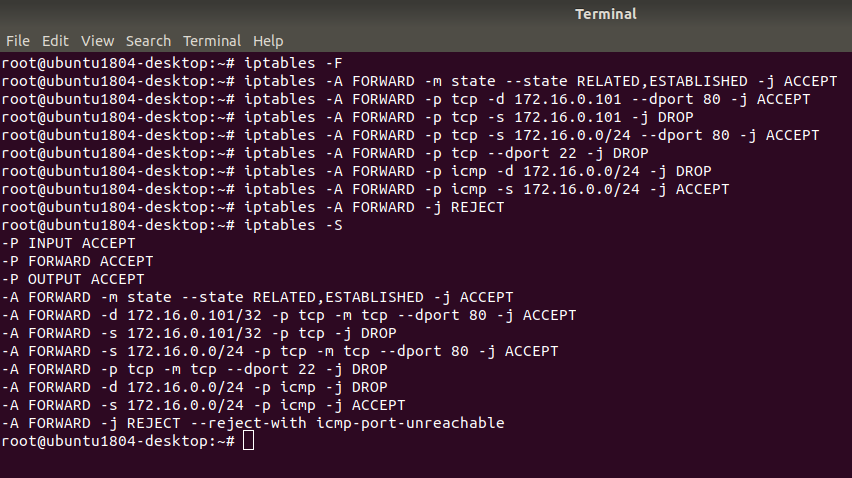

---
## Test Implimentation of The Security Policy, Task IV

---

### A) Show NMap Results of Exposure of Network A

---

### B) Wireshark results of checking the web service between B.1 and A.1, and, A.2 and A.1

---

#### B.1 and A.1, stating whether or not web service is allowed between computers.

#### A.2 and A.1, stating whether or not web service is allowed between computers.

---

### C) Wireshark results of checking the ping between B.1 and A.1, and, A.2 and A.1

---

#### B.1 and A.1, stating whether or not ping is allowed between computers.

#### A.2 and A.1, stating whether or not ping is allowed between computers.

---

## Closing

---

In closing we will discusse how the security policy could be inplimented on the company's server (A.1) and workstations (A.2) and further whether or not the security policy, as is, could ensure that classified data will **NOT** be disclosed to computers external to the company (computers on network B)

### A) Show iptables rules to enforce the security policy in A.1

The following is an implimentation for the iptables rules that would enforce the security policy in the company's server (represented as A.1). An explination of these rules and why the are used follows after the illistration.

```bash
1: $ iptables -A INPUT -m state --state RELATED,ESTABLISHED -j ACCEPT
2: $ iptables -A INPUT -p tcp -s 172.16.0.101/24 --dport 80 -j ACCEPT
3: $ iptables -A INPUT -p tcp -s 10.0.0.1/24 --dport 80 -j ACCEPT
4: $ iptables -A INPUT -p tcp -s 172.16.0.101/24 --dport 22 -j ACCEPT
5: $ iptables -A INPUT -p icmp -s 172.16.0.101/24 -j ACCEPT
6: $ iptables -A INPUT -s 172.16.0.101/24 -j DROP
```

#### Explination

The issues found with the security policy, as is, in regards to the company's server were found in policy rule 'b', "The server provides only SSH and web service to the workstations." The reason that this policy could not be implimented on the network router (R) is because these connections skipped the router entirly at the switch level and 'R' was unable to prevent their connection. In fact, 'R' never saw that they were talking to eachother. So, the above policy should be implimented on 'A.1'. A line-by-line explination follows:

- line 1: This command will **Append** to **INPUT** to **ACCEPT** all related and established rules.
- line 2: This command will **Append** to **INPUT** to **ACCEPT** all traffic on port **80** from the workstation's IP, there by enabling **Web service**.
- line 3: This command will **Append** to **INPUT** to **ACCEPT** all traffic on port **80** from the external network 'B', there by enabling **Web service**.
- line 4: This command will **Append** to **INPUT** to **ACCEPT** all traffic on port **22** from the workstation's IP, there by enabling **SSH**. 
- line 5: This command will **Append** to **INPUT** to **ACCEPT** all **icmp** protocall requests, this will allow for responses to connection.
- line 6: This command will **DROP** all other connection attempts to the server.

### B) Show iptables rules to enforce the security policy in A.2

The following is an implimentation for the iptables rules that would enforce the security policy in the company's server (represented as A.2). An explination of these rules and why the are used follows after the illistration.

```bash
1: $ iptables -A INPUT -m state --state RELATED,ESTABLISHED -j ACCEPT
2: $ iptables -A INPUT -j DROP
```

### Explination

The issues found with teh security policy as it is in regards to the company's workstations were found in the policy rule 'e', "The workstations can access the services hosted by the server." This rule cannot be enforced by the router 'R' as again it wouldn't see these connections and so it must be explicitely stated that workstations 'A.2' can accept traffic coming from the server 'A.1'. The following is an explination of the rules that would enforce that a workstation can access services in network 'A' that are provided by the server. The following is a line-by-line explination:

- line 1: This command will **Append** to **INPUT** to **ACCEPT** all related and established rules, this includes services provided by the server.
- line 2: This command will **DROP** all other traffic.

### C) Discussion of how the security policy could ensure non-Disclosure

The issues we found with non-disclosure in regards to the security palicy as it is written are that there seems to be no safegards in what information could be passed through 'HTTP' as there is no restriction to what protocalls can be used. The policy rules 'e' and 'f' state that the workstations can access all services provided by the server and that the workstations can access web services provided by external computers. If a workstation interacted with an external web services and this was on a non-secure network connection, then the external server could infect the workstation with malware that could then interact with the server from the workstation and create a backdoor to the server through the workstation. Furthermore, policy rule 'a' has a similer issue for the same reasoning. If an external computer attempted to pass a script as an input to the server in some way, known as cross-site scripting, then then all accounts on the server could suffer from a data-leak.

These issues with the security policy would lead us to declare that the system could be at risk and we would deem that the system is unsecure. We do not believe that these policies would prevent the disclosure of classified data nor insure the integrity of the systems on the componies internal network without revision.
